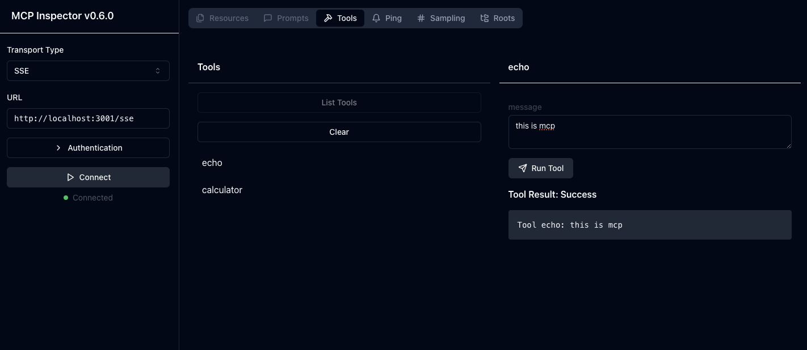
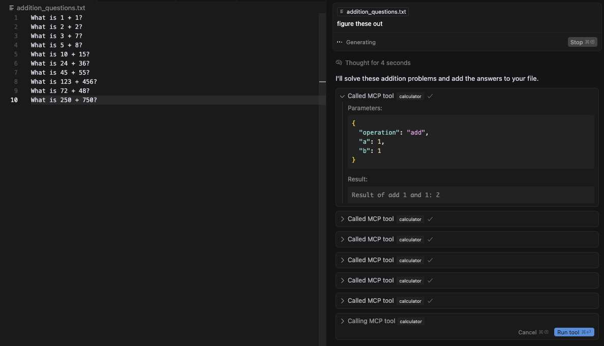
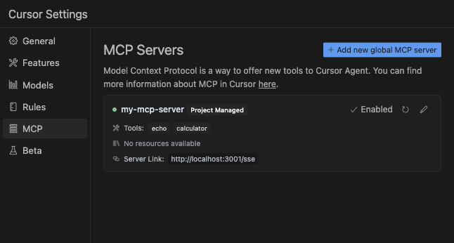

# MCP Node SSE Reference Implementation

A simple Model Context Protocol (MCP) server implementation using bare Node.js.

## Overview

This project implements an MCP server using native Node.js HTTP capabilities. We chose Node.js over frameworks like Fastify, Express, or Bun.js because they have less straightforward support for Server-Sent Events (SSE).

All MCP-specific components are located in the `mcp` folder, following the protocol specification.

Try adding `tools`. Haven't tested it on `resources` and `prompts` yet.

## Running the Server

```bash
npm install
npm run dev
```

## Testing with MCP Inspector

You can use the [MCP Inspector](https://github.com/modelcontextprotocol/inspector) to test this implementation:

```bash
npx @modelcontextprotocol/inspector node server.js
```

This will:
1. Start your MCP server
2. Open a debugging UI (default port 5173)
3. Create a proxy server (default port 3000)

### MCP Example Screenshots


*MCP Inspector interface showing available tools like echo and calculator*


*Using the calculator tool to solve addition problems*


*MCP Servers Cursor config 

## Authentication

The sdk requires credential headers to be passed even if they are empty. Authentication headers are handled by the CORS setup (see `src/utils/cors.ts`).

## Zod
The SDK seems to require zod for validating tool schema

## SDK Integration

This implementation uses the [MCP TypeScript SDK](https://github.com/modelcontextprotocol/typescript-sdk)

## License

MIT